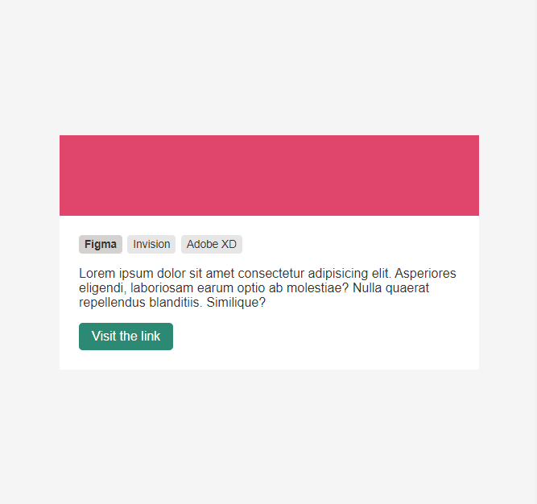

  

<h3 align="center">
:computer: :running:  Acelera Dev React  :running: :computer:
</h3>

## :computer: Project

Nesse projeto usamos o BEM (Block Element Modifier), um padrão de nomenclatura que utilizamos para manter o nosso projeto simples e organizado.

---

Made by :blue_heart: by [Larissa Araújo](https://github.com/arauj0)
